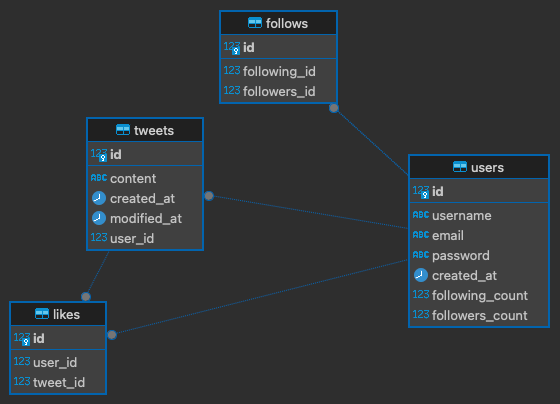

# twitter-clone-backend

## How to run
```
air
```

## Development Process
### Stage 1
Features:
- [x] Sign up
- [x] Login
- [x] Tweet (create, edit, delete)
- [x] Follow/unfollow

## Stage 2
Implement layered architecture & request validation. Developed in '/v2/{...}' endpoint.

###
Improvements:
- [x] E2E Testing
- [x] Refactored to layered architecture

Features:
- [x] Like

## Stage 3
- [ ] Implement redis for cache user profile (including user last 10 tweets)

## ERD
Migration version: 20241214113457

