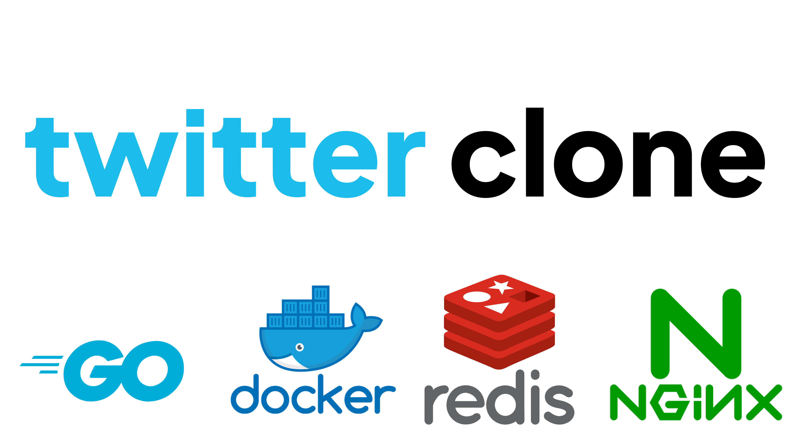

# Twitter Clone Backend

<p align="center">

</p>

## Table of Contents
* [About The Project](#about-the-project)
    + [Build With](#build-with)
* [Development Process](#development-process)
    + [Stage 1](#stage-1)
    + [Stage 2](#stage-2)
    + [Stage 3](#stage-3)
* [ERD](#erd)
* [Caching Mechanism](#caching-mechanism)
    + [Cache Expiration](#cache-expiration)
* [Lesson Learned](#lesson-learned)

## About The Project
A clone of the Twitter web application with features such as tweets, user profiles, and a news feed. I aimed to minimize the use of external Go libraries, leveraging Go's native features as much as possible. Some of the things I implemented can be found under [Leeson Learned](#lesson-learned)

### Build With
- Go
- PostgreSQL
- Redis
- CI/CD: Docker, Github Actions

## Development Process
### Stage 1
Features:
- [x] Register
- [x] Login
- [x] Tweet (create, edit, delete)
- [x] Follow/unfollow
- [x] E2E Testing

### Stage 2
Improvements:
- [x] Refactored to layered architecture (handler, service, and repository)
- [x] Request validation

Features:
- [x] Like/unlike

### Stage 3
- [x] Implemented redis for user profile caching
 <!-- (including user last 10 tweets) -->
- [x] News feed

## ERD


## Caching Mechanism
The user profile displays information such as the username, follower/following count, and recent tweets. The response structure is shown below, with the following information being cached.
```
userResponse := struct {
    Id                 int            `json:"id"`
    Username           string         `json:"username"`
    FollowerCount      int            `json:"followerCount"`
    FollowingCount     int            `json:"followingCount"`
    RecentTweetsLength int            `json:"recentTweetsLength"`
    RecentTweets       []models.Tweet `json:"recentTweets"`
}
```

The decision tree of caching can be seen below. The cache is saved as `key=user.id:{id}, value = userResponse`.
```
is $ (root key) exist?
    yes
    is $.recentTweets exist?
        yes
        -> return cache

        no
        cache miss for $.recentTweets
        get recentTweets from db and store it to cache
        -> return the combined data from db (recentTweets) and cache (userProfile)
    no
    get userProfile with recentTweets from db
    store it to cache
    -> return fully from db
```

### Cache Expiration
Each time a user profile is added to the cache, the expiration time is set to 10 minutes.
User profile can only meet its expiration date until the end (and be deleted after that) if only these operations are performed:

- `JSON.SET` running partial update on `$.recentTweets`
- `JSON.DEL` running partial update on `$.recentTweets`

Both operations are triggered when a user creates a new tweet. The expiration time resets to 10 minutes each time the **user profile is accessed**.

## Lesson Learned
- Defined a custom HTTP appHandler for error handling, allowing structured error responses to be sent to the client.
- Implemented logging by capturing incoming HTTP requests. This logs the error method, request URL, and request body.
